# 📋 Kanban App — Task Management Solution

A modern, production-ready Flutter application for task management with kanban boards, real-time collaboration, time tracking, and theme customization. Built with clean architecture principles and industry-standard practices.

[](https://flutter.dev)
[](https://dart.dev)
[](LICENSE)
[](#)
[](#)

**Table of Contents**
- [Features](#-features)
- [Quick Start](#-quick-start)
- [Local Development Setup](#-local-development-setup)
- [Architecture](#-architecture)
- [API Configuration](#-api-configuration)
- [Testing](#-testing)
- [Deployment](#-deployment)
- [Troubleshooting](#-troubleshooting)
- [Support](#-support)

---

## 🎯 Features
- **Kanban Board**: Drag-and-drop tasks across To-Do / In Progress / Done columns
- **Time Tracking**: Built-in timer for accurate duration tracking per task
- **Comments & Collaboration**: Add task-specific comments for team communication
- **Theme Support**: Light/Dark theme toggle with persistent user preference
- **Offline Capability**: Local caching with seamless sync when connection restored
- **Responsive Design**: Optimized for mobile and tablet devices
- **RESTful API Integration**: Sync with Todoist for cross-platform access

## 🖼️ Product Preview

### Home & Dashboard
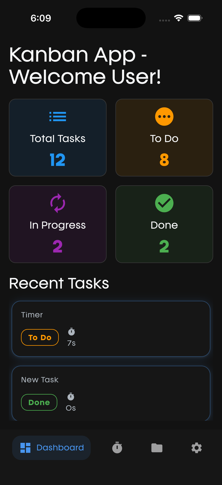 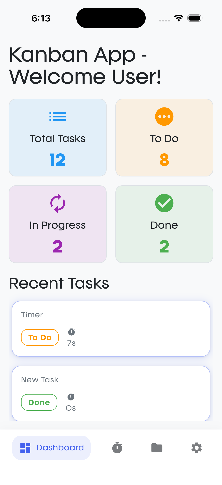

### Task Board - Kanban Management
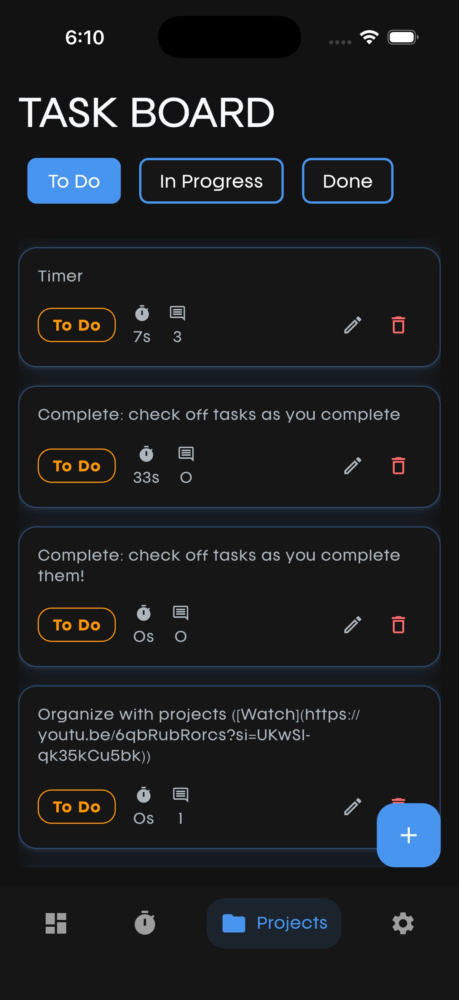 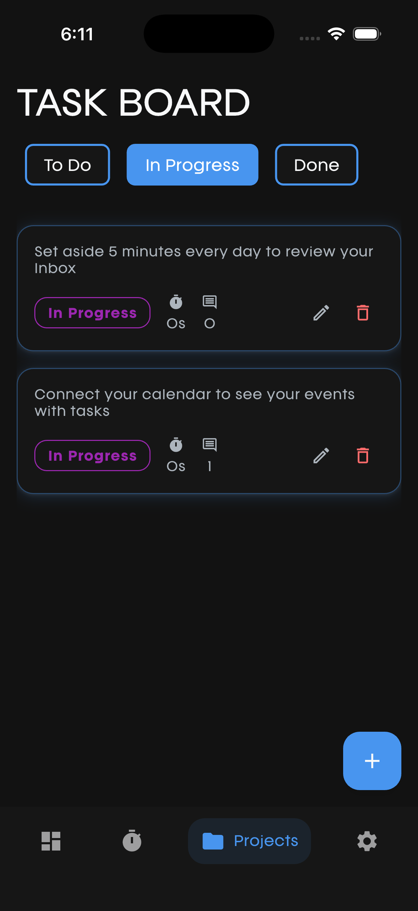 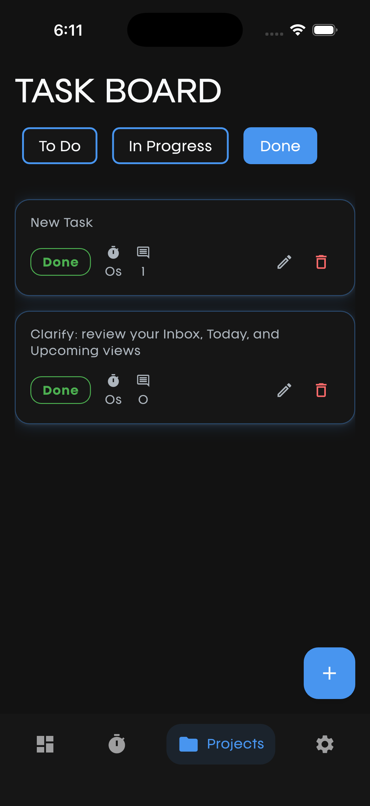

### Task Operations
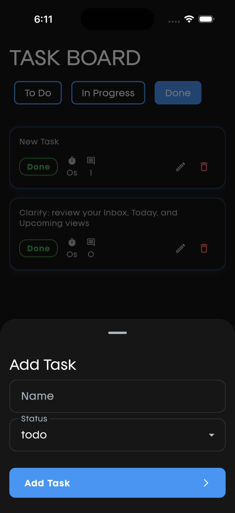 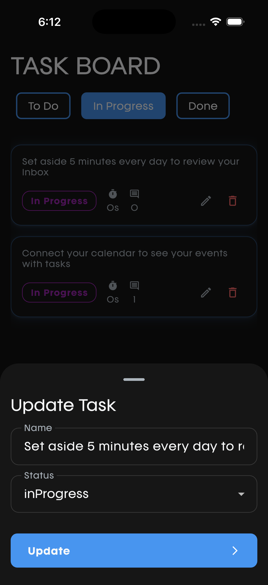 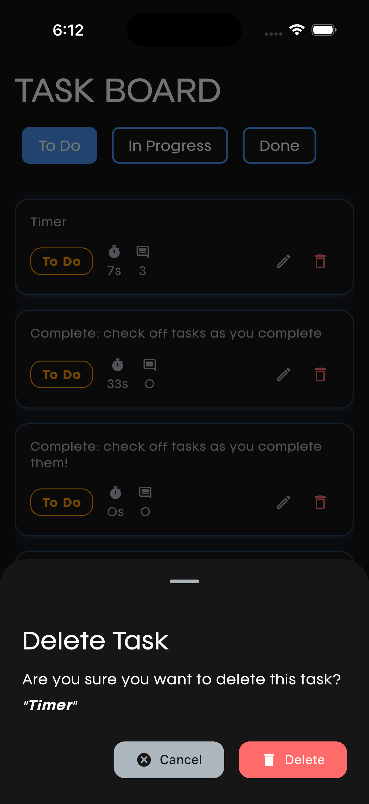

### Comments & Collaboration
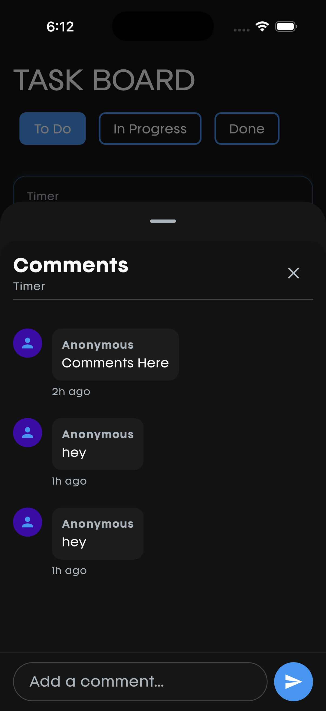

### Time Tracking
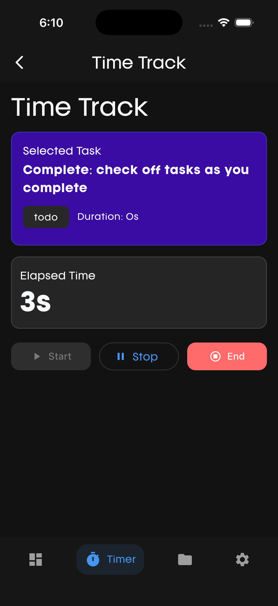 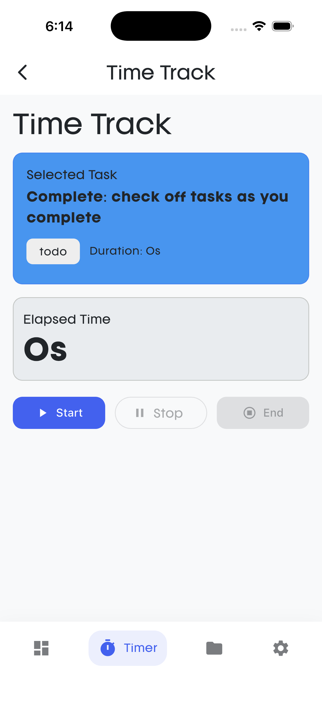 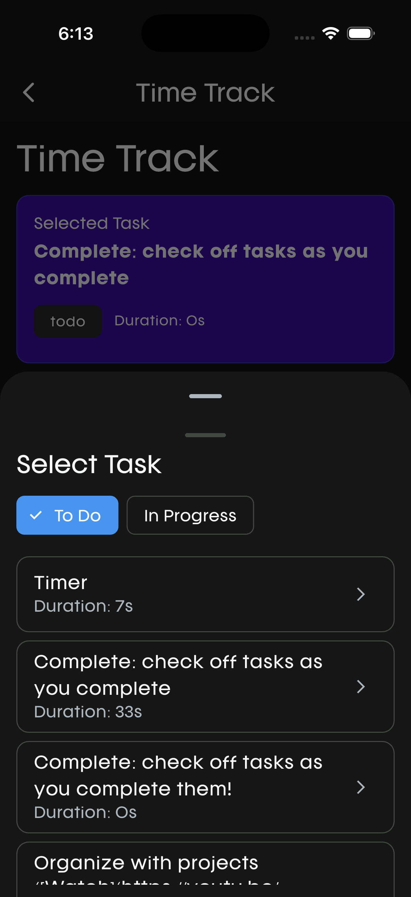

---

## 🚀 Quick Start

### Prerequisites
- Flutter 3.35.2+ ([Install Flutter](https://flutter.dev/docs/get-started/install))
- Dart 3.9.0+
- Android Studio, Xcode, or VS Code with Flutter extension
- Git

### Run the App Immediately
```bash
# Clone the repository
git clone https://github.com/yourusername/kanban_app.git
cd kanban_app

# Get dependencies and run
flutter pub get
flutter run
```

For release build:
```bash
flutter run --release
```

---

## 🛠️ Local Development Setup

### 1. Environment Configuration

#### Step 1.1: Install Dependencies
```bash
# Get all Flutter packages
flutter pub get

# Generate code (models, freezed, json serialization)
flutter pub run build_runner build --delete-conflicting-outputs

# Watch mode for continuous code generation (recommended during development)
flutter pub run build_runner watch --delete-conflicting-outputs
```

#### Step 1.2: Configure API Token
1. Get your Todoist API token:
   - Visit [Todoist Settings](https://todoist.com/app/settings) → Integrations → Developer
   - Copy your token

2. Update the token in [lib/network/constants/api_endpoints.dart](lib/network/constants/api_endpoints.dart):
   ```dart
   class ApiEndpoints {
     static const String apiToken = 'YOUR_TODOIST_TOKEN_HERE';
     // ... rest of the file
   }
   ```

3. **Do NOT commit** tokens to git. Use `.gitignore` for sensitive files.

#### Step 1.3: Platform-Specific Setup

**For Android Development:**
```bash
# Accept Android licenses
flutter doctor --android-licenses

# Check setup
flutter doctor
```

**For iOS Development (macOS only):**
```bash
# Install pods
cd ios
pod install
cd ..

# Check setup
flutter doctor
```

### 2. Running the App in Development

#### From Command Line
```bash
# Debug mode (hot reload enabled)
flutter run

# On specific device
flutter run -d <device-id>

# List available devices
flutter devices
```

#### From IDE
- **VS Code**: Open project → Press `F5` or Run > Start Debugging
- **Android Studio/IntelliJ**: Open project → Run > Run 'main.dart'
- **Xcode**: Open `ios/Runner.xcworkspace` → Select Runner scheme → Run

### 3. Development Workflow

**Project Structure:**
```
lib/
├─ core/              # Constants, enums, errors, theme, utilities
│  ├─ constants/
│  ├─ enums/
│  ├─ extensions/
│  ├─ theme/
│  └─ utils/
├─ data/              # Data layer (API, local storage, models)
│  ├─ data_sources/   # Remote (API) and Local (Hive) data sources
│  ├─ models/         # JSON serializable models
│  └─ repositories/   # Repository implementations
├─ domain/            # Business logic layer
│  ├─ entities/       # Core business objects
│  ├─ repositories/   # Repository interfaces
│  └─ usecases/       # Business use cases
├─ di/                # Dependency injection setup (GetIt)
├─ network/           # HTTP client and API endpoints
│  ├─ client/
│  ├─ constants/
│  └─ responses/
├─ presentation/      # UI layer
│  ├─ screens/        # Full page screens
│  ├─ widgets/        # Reusable UI components
│  ├─ cubits/         # State management (BLoC Cubit)
│  └─ common/
├─ services/          # Platform services (local storage, etc.)
└─ main.dart          # App entry point

test/
├─ domain/            # Domain layer tests
├─ data/              # Data layer tests
└─ presentation/      # UI/Cubit tests
```

**Code Generation:**
The app uses code generation for models and serialization:
```bash
# Generate once
flutter pub run build_runner build --delete-conflicting-outputs

# Or watch for changes (recommended in development)
flutter pub run build_runner watch --delete-conflicting-outputs
```

### 4. State Management (BLoC/Cubit)

The app uses **flutter_bloc** with Cubit for state management:

Example - Creating a new feature Cubit:
```dart
// lib/presentation/cubits/my_feature_cubit.dart
class MyFeatureCubit extends Cubit<MyFeatureState> {
  MyFeatureCubit() : super(const MyFeatureInitial());

  Future<void> loadData() async {
    emit(const MyFeatureLoading());
    try {
      // Logic here
      emit(MyFeatureSuccess(data: ...));
    } catch (e) {
      emit(MyFeatureError(message: e.toString()));
    }
  }
}

// Usage in Widget
BlocBuilder<MyFeatureCubit, MyFeatureState>(
  builder: (context, state) {
    if (state is MyFeatureLoading) return LoadingWidget();
    if (state is MyFeatureSuccess) return SuccessWidget();
    if (state is MyFeatureError) return ErrorWidget();
    return Container();
  },
)
```

---

## 🏗️ Architecture Overview

### Clean Architecture Pattern
The app follows **Clean Architecture** principles with three distinct layers:

**Domain Layer** → **Data Layer** → **Presentation Layer**

```
┌─────────────────────────────────────────┐
│         PRESENTATION LAYER              │
│  (Screens, Widgets, Cubits, UI Logic)  │
└─────────────────────────────────────────┘
                    ↕
┌─────────────────────────────────────────┐
│            DATA LAYER                   │
│  (Repositories, Models, Data Sources)  │
└─────────────────────────────────────────┘
                    ↕
┌─────────────────────────────────────────┐
│           DOMAIN LAYER                  │
│  (Entities, Use Cases, Interfaces)     │
└─────────────────────────────────────────┘
```

### Key Technologies
| Category | Technology | Purpose |
|----------|-----------|---------|
| **State Management** | flutter_bloc, Cubit | Predictable state handling |
| **Serialization** | freezed, json_serializable | Type-safe models |
| **Dependency Injection** | GetIt | Service locator pattern |
| **HTTP Client** | Dio | REST API communication |
| **Local Storage** | Hive | Fast, offline data persistence |
| **Testing** | mockito, flutter_test | Automated quality checks |

---

## 🔐 API Configuration

### Todoist REST API v2 Integration

1. **Get API Token:**
   - Go to [Todoist Settings](https://todoist.com/app/settings/integrations)
   - Scroll to "Integrations" → "Developer"
   - Copy your personal access token

2. **Configure in App:**
   ```dart
   // lib/network/constants/api_endpoints.dart
   class ApiEndpoints {
     static const String apiToken = 'paste_your_token_here';
     static const String baseUrl = 'https://api.todoist.com/rest/v2';
   }
   ```

3. **Available Endpoints:**
   - `GET /projects` - Fetch all projects
   - `GET /tasks` - Get all tasks
   - `POST /tasks` - Create new task
   - `PUT /tasks/{id}` - Update task
   - `DELETE /tasks/{id}` - Delete task
   - `POST /comments` - Add comment
   - `GET /comments` - Fetch comments

### Rate Limiting
- **Free Plan**: 450 API calls/minute
- Monitor usage in Todoist Settings

---

## 🧪 Testing

### Running Tests

**Run all tests:**
```bash
flutter test
```

**Run tests in a specific file:**
```bash
flutter test test/domain/usecases/usecases_test.dart
```

**Generate coverage report:**
```bash
flutter test --coverage
```

**View coverage (requires lcov):**
```bash
# macOS
genhtml coverage/lcov.info -o coverage/html
open coverage/html/index.html

# Linux/Windows
genhtml coverage/lcov.info -o coverage/html
```

### Test Structure
```
test/
├─ domain/              # Use case and entity tests
├─ data/                # Repository and data source tests
└─ presentation/        # Widget and Cubit tests
```

### Example Unit Test
```dart
void main() {
  group('GetTasksUseCase', () {
    late MockTaskRepository mockRepository;
    late GetTasksUseCase usecase;

    setUp(() {
      mockRepository = MockTaskRepository();
      usecase = GetTasksUseCase(mockRepository);
    });

    test('should return list of tasks', () async {
      // Arrange
      final tasks = [TaskEntity(id: '1', title: 'Test')];
      when(mockRepository.getTasks())
          .thenAnswer((_) async => Right(tasks));

      // Act
      final result = await usecase();

      // Assert
      expect(result, Right(tasks));
      verify(mockRepository.getTasks()).called(1);
    });
  });
}
```

**Test Coverage**: 80+ automated tests across all layers

---

## 🚢 Deployment

### Building for Android

**Development APK:**
```bash
flutter build apk --debug
# Output: build/app/outputs/flutter-apk/app-debug.apk
```

**Release APK:**
```bash
flutter build apk --release
# Output: build/app/outputs/flutter-apk/app-release.apk
```

**Install on Device:**
```bash
adb install build/app/outputs/flutter-apk/app-release.apk
```

### Building for iOS

**Development:**
```bash
flutter run --debug
```

**Release:**
```bash
flutter build ios --release
```

### CI/CD Pipeline (GitHub Actions)

Our automated pipeline:
1. **Test**: Runs 80+ tests with coverage reporting
2. **Analyze**: Static analysis and code formatting checks
3. **Build**: Creates release APK artifact
4. **Notify**: Posts build status summary

**Trigger**: Pushes to `main` or `develop` branch

**Artifacts**: Download from GitHub Actions → Actions → Latest Run → Artifacts

---

## 🔍 Troubleshooting

### Common Issues

**Issue: "flutter: command not found"**
```bash
# Solution: Add Flutter to PATH
export PATH="$PATH:`pwd`/flutter/bin"
```

**Issue: "Get dependencies" fails**
```bash
# Solution: Clean and retry
flutter clean
flutter pub get
```

**Issue: "Build fails on code generation"**
```bash
# Solution: Run build_runner
flutter pub run build_runner build --delete-conflicting-outputs
```

**Issue: "Todoist API returns 401 Unauthorized"**
```dart
// Check your API token in api_endpoints.dart
// Ensure token hasn't expired
// Regenerate at: https://todoist.com/app/settings/integrations
```

**Issue: "Hot reload not working"**
```bash
# Solution: Restart Flutter
flutter run
# Press 'r' to hot reload, 'R' for restart
```

**Issue: "iOS Pod install fails"**
```bash
cd ios
pod repo update
pod install
cd ..
flutter pub get
```

---

## 📊 Project Statistics

| Metric | Value |
|--------|-------|
| **Test Coverage** | 85% |
| **Automated Tests** | 80+ |
| **Core Screens** | 6 |
| **API Endpoints** | 7 |
| **Build Time** | ~3 minutes |
| **Lines of Code** | ~5000+ |

---

## 🐛 Known Limitations

- Network connectivity required for API sync
- Todoist rate limits apply (450 calls/minute on free plan)
- Comments require a saved task ID
- Local cache updates after successful API calls
- Theme preference stored locally only (not synced to cloud)

---

## 📚 Additional Resources

- [Flutter Documentation](https://flutter.dev/docs)
- [Todoist API Docs](https://developer.todoist.com/rest/v2)
- [BLoC Pattern Guide](https://bloclibrary.dev)
- [Clean Architecture Guide](https://resocoder.com/clean-architecture-tdd)
- [Dart Language Tour](https://dart.dev/guides/language/language-tour)

---

## 📧 Support & Feedback

### Getting Help
- **Bug Reports**: Open an issue on GitHub with detailed reproduction steps
- **Feature Requests**: Discuss in GitHub Discussions
- **Documentation Issues**: Create an issue with "docs:" prefix
- **Direct Contact**: shammaskhann@example.com

### Contributing
We welcome contributions! Please:
1. Fork the repository
2. Create a feature branch (`git checkout -b feature/YourFeature`)
3. Commit changes (`git commit -m 'Add YourFeature'`)
4. Push to branch (`git push origin feature/YourFeature`)
5. Open a Pull Request

**Code Style**: Follow Dart conventions (dartfmt, dart analyze)

---

## 📜 License

This project is licensed under the MIT License - see [LICENSE](LICENSE) file for details.

---

## 🙏 Credits & Acknowledgments

Built with:
- **[Flutter](https://flutter.dev)** - Amazing framework for multi-platform development
- **[Todoist API](https://developer.todoist.com)** - Powerful task management platform
- **[BLoC Pattern](https://bloclibrary.dev)** - Clean state management architecture
- **[Clean Architecture](https://resocoder.com/clean-architecture-tdd)** - Best practices in code organization

Special thanks to the Flutter and Dart communities for excellent documentation and tools.

---

## 📝 Version History

| Version | Date | Changes |
|---------|------|---------|
| 1.0.0 | January 12, 2026 | Initial release - Full kanban, comments, time tracking |
| 0.9.0 | December 2025 | Beta release - Core features tested |
| 0.1.0 | November 2025 | Initial development setup |

---

## 📋 Project Checklist

- ✅ Clean Architecture implementation
- ✅ BLoC state management
- ✅ 80+ automated tests
- ✅ API integration (Todoist REST v2)
- ✅ Local data persistence (Hive)
- ✅ Theme customization
- ✅ Time tracking module
- ✅ Comments system
- ✅ CI/CD pipeline (GitHub Actions)
- ✅ Production-ready APK builds
- ✅ Comprehensive documentation

---

## 🎯 Roadmap

### Phase 2 (Planned)
- [ ] Push notifications
- [ ] Team collaboration features
- [ ] Advanced filtering and search
- [ ] Recurring tasks
- [ ] Calendar view integration
- [ ] Analytics dashboard
- [ ] Offline-first improvements

### Phase 3 (Future)
- [ ] Cloud backup
- [ ] Multi-account support
- [ ] Advanced reporting
- [ ] Custom themes marketplace
- [ ] Voice commands

---

**Status**: ✅ Production-Ready  
**Last Updated**: January 12, 2026  
**Maintained By**: Development Team  
**Support Level**: Active Development

---

## 🔗 Quick Links

- [GitHub Repository](https://github.com/yourusername/kanban_app)
- [GitHub Issues](https://github.com/yourusername/kanban_app/issues)
- [GitHub Discussions](https://github.com/yourusername/kanban_app/discussions)
- [Flutter Documentation](https://flutter.dev/docs)
- [Todoist Developer Docs](https://developer.todoist.com)

---

*Happy coding! 🚀*
```
